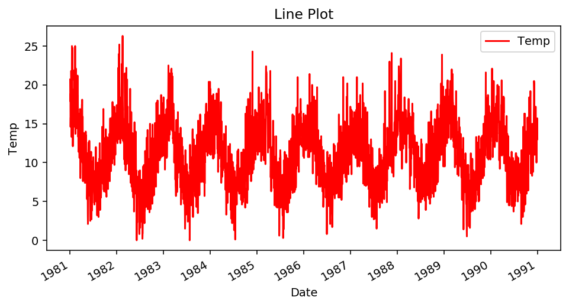
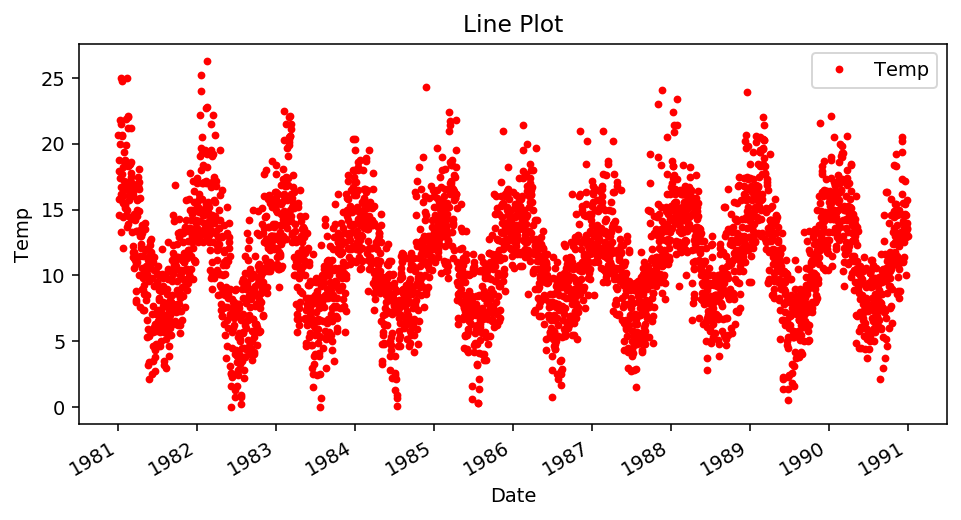
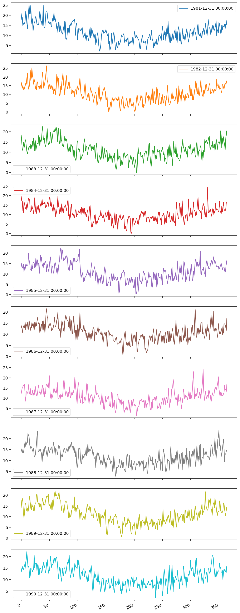
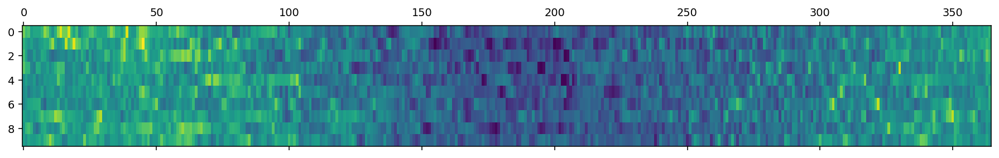
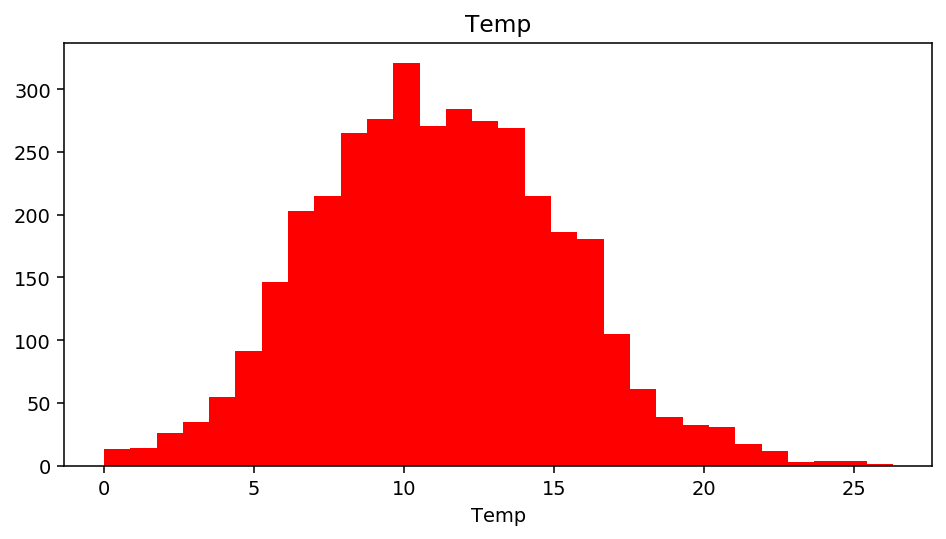
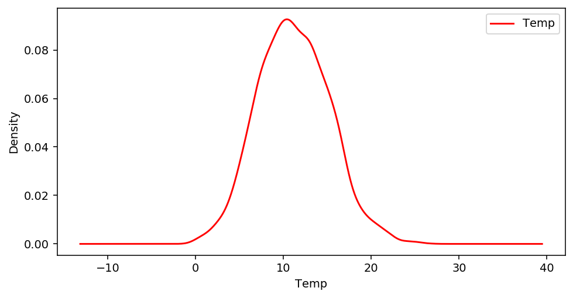

# Time Series Plot 


```python
import pandas as pd
import numpy as np
import matplotlib.pyplot as plt
%matplotlib inline
```


```python
plt.rcParams['figure.figsize'] = [8, 4]
plt.rcParams['figure.dpi'] = 140
```


```python
df = pd.read_csv('daily-temperature.csv')
df
```


<div>
<style scoped>
    .dataframe tbody tr th:only-of-type {
        vertical-align: middle;
    }

    .dataframe tbody tr th {
        vertical-align: top;
    }

    .dataframe thead th {
        text-align: right;
    }
</style>
<table border="1" class="dataframe">
  <thead>
    <tr style="text-align: right;">
      <th></th>
      <th>Date</th>
      <th>Temp</th>
    </tr>
  </thead>
  <tbody>
    <tr>
      <th>0</th>
      <td>1981-01-01</td>
      <td>20.7</td>
    </tr>
    <tr>
      <th>1</th>
      <td>1981-01-02</td>
      <td>17.9</td>
    </tr>
    <tr>
      <th>2</th>
      <td>1981-01-03</td>
      <td>18.8</td>
    </tr>
    <tr>
      <th>3</th>
      <td>1981-01-04</td>
      <td>14.6</td>
    </tr>
    <tr>
      <th>4</th>
      <td>1981-01-05</td>
      <td>15.8</td>
    </tr>
    <tr>
      <th>...</th>
      <td>...</td>
      <td>...</td>
    </tr>
    <tr>
      <th>3645</th>
      <td>1990-12-27</td>
      <td>14.0</td>
    </tr>
    <tr>
      <th>3646</th>
      <td>1990-12-28</td>
      <td>13.6</td>
    </tr>
    <tr>
      <th>3647</th>
      <td>1990-12-29</td>
      <td>13.5</td>
    </tr>
    <tr>
      <th>3648</th>
      <td>1990-12-30</td>
      <td>15.7</td>
    </tr>
    <tr>
      <th>3649</th>
      <td>1990-12-31</td>
      <td>13.0</td>
    </tr>
  </tbody>
</table>
<p>3650 rows × 2 columns</p>
</div>


```python
df.info()
```

    <class 'pandas.core.frame.DataFrame'>
    RangeIndex: 3650 entries, 0 to 3649
    Data columns (total 2 columns):
     #   Column  Non-Null Count  Dtype  
    ---  ------  --------------  -----  
     0   Date    3650 non-null   object 
     1   Temp    3650 non-null   float64
    dtypes: float64(1), object(1)
    memory usage: 57.2+ KB


```python
df = pd.read_csv('daily-temperature.csv', parse_dates=True)
df.info()
```

    <class 'pandas.core.frame.DataFrame'>
    RangeIndex: 3650 entries, 0 to 3649
    Data columns (total 2 columns):
     #   Column  Non-Null Count  Dtype  
    ---  ------  --------------  -----  
     0   Date    3650 non-null   object 
     1   Temp    3650 non-null   float64
    dtypes: float64(1), object(1)
    memory usage: 57.2+ KB


```python
df['Date'] = pd.to_datetime(df['Date'])
```


```python
df.info()
```

    <class 'pandas.core.frame.DataFrame'>
    RangeIndex: 3650 entries, 0 to 3649
    Data columns (total 2 columns):
     #   Column  Non-Null Count  Dtype         
    ---  ------  --------------  -----         
     0   Date    3650 non-null   datetime64[ns]
     1   Temp    3650 non-null   float64       
    dtypes: datetime64[ns](1), float64(1)
    memory usage: 57.2 KB


```python
df.set_index('Date', inplace=True)
```


```python
df.head()
```


<div>
<style scoped>
    .dataframe tbody tr th:only-of-type {
        vertical-align: middle;
    }

    .dataframe tbody tr th {
        vertical-align: top;
    }

    .dataframe thead th {
        text-align: right;
    }
</style>
<table border="1" class="dataframe">
  <thead>
    <tr style="text-align: right;">
      <th></th>
      <th>Temp</th>
    </tr>
    <tr>
      <th>Date</th>
      <th></th>
    </tr>
  </thead>
  <tbody>
    <tr>
      <th>1981-01-01</th>
      <td>20.7</td>
    </tr>
    <tr>
      <th>1981-01-02</th>
      <td>17.9</td>
    </tr>
    <tr>
      <th>1981-01-03</th>
      <td>18.8</td>
    </tr>
    <tr>
      <th>1981-01-04</th>
      <td>14.6</td>
    </tr>
    <tr>
      <th>1981-01-05</th>
      <td>15.8</td>
    </tr>
  </tbody>
</table>
</div>


# Line and Scatter Plot 


```python
df.plot(color = 'red')
plt.ylabel('Temp')
plt.title('Line Plot')
plt.show()
```





```python
df.plot(style = '.', color = 'red')
plt.ylabel('Temp')
plt.title('Line Plot')
plt.show()
```





## Subplots 


```python
groups = df.groupby(pd.Grouper(freq = 'A'))
```


```python
keys = groups.groups.keys()
```


```python
keys
```


    dict_keys([Timestamp('1981-12-31 00:00:00', freq='A-DEC'), Timestamp('1982-12-31 00:00:00', freq='A-DEC'), Timestamp('1983-12-31 00:00:00', freq='A-DEC'), Timestamp('1984-12-31 00:00:00', freq='A-DEC'), Timestamp('1985-12-31 00:00:00', freq='A-DEC'), Timestamp('1986-12-31 00:00:00', freq='A-DEC'), Timestamp('1987-12-31 00:00:00', freq='A-DEC'), Timestamp('1988-12-31 00:00:00', freq='A-DEC'), Timestamp('1989-12-31 00:00:00', freq='A-DEC'), Timestamp('1990-12-31 00:00:00', freq='A-DEC')])


```python
groups.get_group('1981-12-31')
```


<div>
<style scoped>
    .dataframe tbody tr th:only-of-type {
        vertical-align: middle;
    }

    .dataframe tbody tr th {
        vertical-align: top;
    }

    .dataframe thead th {
        text-align: right;
    }
</style>
<table border="1" class="dataframe">
  <thead>
    <tr style="text-align: right;">
      <th></th>
      <th>Temp</th>
    </tr>
    <tr>
      <th>Date</th>
      <th></th>
    </tr>
  </thead>
  <tbody>
    <tr>
      <th>1981-01-01</th>
      <td>20.7</td>
    </tr>
    <tr>
      <th>1981-01-02</th>
      <td>17.9</td>
    </tr>
    <tr>
      <th>1981-01-03</th>
      <td>18.8</td>
    </tr>
    <tr>
      <th>1981-01-04</th>
      <td>14.6</td>
    </tr>
    <tr>
      <th>1981-01-05</th>
      <td>15.8</td>
    </tr>
    <tr>
      <th>...</th>
      <td>...</td>
    </tr>
    <tr>
      <th>1981-12-27</th>
      <td>15.5</td>
    </tr>
    <tr>
      <th>1981-12-28</th>
      <td>13.3</td>
    </tr>
    <tr>
      <th>1981-12-29</th>
      <td>15.6</td>
    </tr>
    <tr>
      <th>1981-12-30</th>
      <td>15.2</td>
    </tr>
    <tr>
      <th>1981-12-31</th>
      <td>17.4</td>
    </tr>
  </tbody>
</table>
<p>365 rows × 1 columns</p>
</div>


```python
for key in keys:
    print(key)
```

    1981-12-31 00:00:00
    1982-12-31 00:00:00
    1983-12-31 00:00:00
    1984-12-31 00:00:00
    1985-12-31 00:00:00
    1986-12-31 00:00:00
    1987-12-31 00:00:00
    1988-12-31 00:00:00
    1989-12-31 00:00:00
    1990-12-31 00:00:00


```python
key
```


    Timestamp('1990-12-31 00:00:00', freq='A-DEC')


```python
groups.get_group(key)['Temp'].values
```


    array([14.8, 13.3, 15.6, 14.5, 14.3, 15.3, 16.4, 14.8, 17.4, 18.8, 22.1,
           19. , 15.5, 15.8, 14.7, 10.7, 11.5, 15. , 14.5, 14.5, 13.3, 14.3,
           14.3, 20.5, 15. , 17.1, 16.9, 16.9, 13.6, 16.4, 16.1, 12. , 12.2,
           14.8, 14.8, 14.4, 12.9, 13.4, 15.9, 16.1, 17.6, 15.6, 15. , 13. ,
           14.1, 17.3, 15.7, 18.6, 12.7, 14. , 13.7, 16.3, 20. , 17. , 15.2,
           16.5, 16.5, 17.3, 19.1, 19.3, 17.3, 19. , 19.8, 19.3, 17.2, 14.2,
           10.3, 13. , 15.3, 15. , 12.1,  9.2, 11. , 15. , 11.6, 11.6, 15.1,
           15. , 13.6, 12.5, 14.3, 16. , 17.4, 16.9, 18. , 20.6, 14.2, 10.9,
           11.9, 13.3, 15.3, 14.7, 11. , 12.2, 14.2, 17. , 15.8, 15.2, 15.1,
           14.7, 18.5, 16.4, 18.4, 15.1,  9.9, 10.2, 12.6, 13.2, 11.5, 13.8,
           14.5, 14.7, 11.2, 12.7, 13.7, 11.5, 10.4,  8.9, 11.1,  9.5, 13. ,
           13.9, 12.6, 14.3, 16. , 13.3,  7. ,  4.9,  6.9, 13.7, 10.6, 12.3,
           11.1, 10.2,  9.5,  8.9, 13.4,  9.1,  9.4,  8.7,  5.8,  4.5,  7.2,
           10. , 10.5, 10.7,  8.2,  6.1,  4.5,  6.1,  9.8,  9.7,  8.2,  8.4,
            8.5, 10.4,  6.8,  6. ,  6.6,  7.8, 10.3,  7.2,  7.4, 11.4,  5.4,
            4.4,  6.4,  9.3,  7.7,  8.1,  8.3,  9.1,  7.7, 10.6,  8.2,  7.9,
            5.2,  5.9,  3.7,  5.6,  9.4,  7.4,  7.3,  7.7,  7.7,  9.3,  4.4,
            5.7, 10.2, 10.2,  9.3,  5.4,  5. ,  7.6,  9.6, 10.4, 11.2,  9.1,
           11.2,  6.8,  8.3,  9.7,  9.6,  9.8, 10.8,  9.2,  6.5,  8.1,  7.3,
            7.9,  6. ,  5. ,  6.8,  9.8,  5.7,  8.6, 10.6,  7.8,  7.7,  8.6,
            6.5,  6.9,  6.4,  8.5,  7.8,  9.3,  8.4,  7.8,  7.4,  7.7,  8.9,
            9.7,  9.9,  6.1,  6.6,  7.6,  7.4,  8. ,  2.1,  5.9, 11.6,  8.6,
            7.9,  6. ,  9.5,  8.6,  7.6, 10.4, 10.3,  7.5,  3. ,  5.3, 10.5,
           14.6, 12.6,  9.8,  7.2, 10.1, 10.4,  3.7,  7.3, 11.6, 16.3,  9.6,
            6.8,  5.2, 10.6, 16.3,  9.8,  4.6, 11.1,  8.7, 10. , 11.3, 10.5,
            9.9, 11. , 14. ,  9.2,  9.8,  6. ,  9.8,  9.2, 11.8, 10.3,  7.5,
            7.7, 15.8, 14.6, 10.5, 11.3, 10.9,  6.4, 10.9,  9. , 10.9, 12.4,
           11.6, 13.3, 14.4, 18.4, 13.6, 14.9, 14.8, 15.4, 11.8, 13. , 11.1,
           12.5, 18.3, 19.2, 15.4, 13.1, 11.5,  8.6, 12.6, 13.8, 14.6, 13.2,
           12.3,  8.8, 10.7,  9.9,  8.3, 15. , 12.2, 10.5, 11.1, 13. , 12.9,
            8.8, 14.7, 14.7, 12.7, 13.3, 13.2, 16.2, 17.3, 20.5, 20.2, 19.4,
           15.5, 14.1, 11. , 11.1, 14. , 11.4, 12.5, 13.4, 13.6, 13.9, 17.2,
           14.7, 15.4, 13.1, 13.2, 13.9, 10. , 12.9, 14.6, 14. , 13.6, 13.5,
           15.7, 13. ])


```python
years = pd.DataFrame()
for key in keys:
    years[key] = groups.get_group(key)['Temp'].values
```


```python
years
```


<div>
<style scoped>
    .dataframe tbody tr th:only-of-type {
        vertical-align: middle;
    }

    .dataframe tbody tr th {
        vertical-align: top;
    }

    .dataframe thead th {
        text-align: right;
    }
</style>
<table border="1" class="dataframe">
  <thead>
    <tr style="text-align: right;">
      <th></th>
      <th>1981-12-31</th>
      <th>1982-12-31</th>
      <th>1983-12-31</th>
      <th>1984-12-31</th>
      <th>1985-12-31</th>
      <th>1986-12-31</th>
      <th>1987-12-31</th>
      <th>1988-12-31</th>
      <th>1989-12-31</th>
      <th>1990-12-31</th>
    </tr>
  </thead>
  <tbody>
    <tr>
      <th>0</th>
      <td>20.7</td>
      <td>17.0</td>
      <td>18.4</td>
      <td>19.5</td>
      <td>13.3</td>
      <td>12.9</td>
      <td>12.3</td>
      <td>15.3</td>
      <td>14.3</td>
      <td>14.8</td>
    </tr>
    <tr>
      <th>1</th>
      <td>17.9</td>
      <td>15.0</td>
      <td>15.0</td>
      <td>17.1</td>
      <td>15.2</td>
      <td>13.8</td>
      <td>13.8</td>
      <td>14.3</td>
      <td>17.4</td>
      <td>13.3</td>
    </tr>
    <tr>
      <th>2</th>
      <td>18.8</td>
      <td>13.5</td>
      <td>10.9</td>
      <td>17.1</td>
      <td>13.1</td>
      <td>10.6</td>
      <td>15.3</td>
      <td>13.5</td>
      <td>18.5</td>
      <td>15.6</td>
    </tr>
    <tr>
      <th>3</th>
      <td>14.6</td>
      <td>15.2</td>
      <td>11.4</td>
      <td>12.0</td>
      <td>12.7</td>
      <td>12.6</td>
      <td>15.6</td>
      <td>15.0</td>
      <td>16.8</td>
      <td>14.5</td>
    </tr>
    <tr>
      <th>4</th>
      <td>15.8</td>
      <td>13.0</td>
      <td>14.8</td>
      <td>11.0</td>
      <td>14.6</td>
      <td>13.7</td>
      <td>16.2</td>
      <td>13.6</td>
      <td>11.5</td>
      <td>14.3</td>
    </tr>
    <tr>
      <th>...</th>
      <td>...</td>
      <td>...</td>
      <td>...</td>
      <td>...</td>
      <td>...</td>
      <td>...</td>
      <td>...</td>
      <td>...</td>
      <td>...</td>
      <td>...</td>
    </tr>
    <tr>
      <th>360</th>
      <td>15.5</td>
      <td>15.3</td>
      <td>13.9</td>
      <td>12.2</td>
      <td>11.5</td>
      <td>14.6</td>
      <td>16.2</td>
      <td>9.5</td>
      <td>13.3</td>
      <td>14.0</td>
    </tr>
    <tr>
      <th>361</th>
      <td>13.3</td>
      <td>16.3</td>
      <td>11.1</td>
      <td>12.0</td>
      <td>10.8</td>
      <td>14.2</td>
      <td>14.2</td>
      <td>12.9</td>
      <td>11.7</td>
      <td>13.6</td>
    </tr>
    <tr>
      <th>362</th>
      <td>15.6</td>
      <td>15.8</td>
      <td>16.1</td>
      <td>12.6</td>
      <td>12.0</td>
      <td>13.2</td>
      <td>14.3</td>
      <td>12.9</td>
      <td>10.4</td>
      <td>13.5</td>
    </tr>
    <tr>
      <th>363</th>
      <td>15.2</td>
      <td>17.7</td>
      <td>20.4</td>
      <td>16.0</td>
      <td>16.3</td>
      <td>11.7</td>
      <td>13.3</td>
      <td>14.8</td>
      <td>14.4</td>
      <td>15.7</td>
    </tr>
    <tr>
      <th>364</th>
      <td>17.4</td>
      <td>16.3</td>
      <td>18.0</td>
      <td>16.4</td>
      <td>14.4</td>
      <td>17.2</td>
      <td>16.7</td>
      <td>14.1</td>
      <td>12.7</td>
      <td>13.0</td>
    </tr>
  </tbody>
</table>
<p>365 rows × 10 columns</p>
</div>


```python
years.plot(subplots = True, figsize = (10, 30))
plt.show()
plt.tight_layout()
```





    <Figure size 1120x560 with 0 Axes>


# Heatmap 


```python
years
```


<div>
<style scoped>
    .dataframe tbody tr th:only-of-type {
        vertical-align: middle;
    }

    .dataframe tbody tr th {
        vertical-align: top;
    }

    .dataframe thead th {
        text-align: right;
    }
</style>
<table border="1" class="dataframe">
  <thead>
    <tr style="text-align: right;">
      <th></th>
      <th>1981-12-31</th>
      <th>1982-12-31</th>
      <th>1983-12-31</th>
      <th>1984-12-31</th>
      <th>1985-12-31</th>
      <th>1986-12-31</th>
      <th>1987-12-31</th>
      <th>1988-12-31</th>
      <th>1989-12-31</th>
      <th>1990-12-31</th>
    </tr>
  </thead>
  <tbody>
    <tr>
      <th>0</th>
      <td>20.7</td>
      <td>17.0</td>
      <td>18.4</td>
      <td>19.5</td>
      <td>13.3</td>
      <td>12.9</td>
      <td>12.3</td>
      <td>15.3</td>
      <td>14.3</td>
      <td>14.8</td>
    </tr>
    <tr>
      <th>1</th>
      <td>17.9</td>
      <td>15.0</td>
      <td>15.0</td>
      <td>17.1</td>
      <td>15.2</td>
      <td>13.8</td>
      <td>13.8</td>
      <td>14.3</td>
      <td>17.4</td>
      <td>13.3</td>
    </tr>
    <tr>
      <th>2</th>
      <td>18.8</td>
      <td>13.5</td>
      <td>10.9</td>
      <td>17.1</td>
      <td>13.1</td>
      <td>10.6</td>
      <td>15.3</td>
      <td>13.5</td>
      <td>18.5</td>
      <td>15.6</td>
    </tr>
    <tr>
      <th>3</th>
      <td>14.6</td>
      <td>15.2</td>
      <td>11.4</td>
      <td>12.0</td>
      <td>12.7</td>
      <td>12.6</td>
      <td>15.6</td>
      <td>15.0</td>
      <td>16.8</td>
      <td>14.5</td>
    </tr>
    <tr>
      <th>4</th>
      <td>15.8</td>
      <td>13.0</td>
      <td>14.8</td>
      <td>11.0</td>
      <td>14.6</td>
      <td>13.7</td>
      <td>16.2</td>
      <td>13.6</td>
      <td>11.5</td>
      <td>14.3</td>
    </tr>
    <tr>
      <th>...</th>
      <td>...</td>
      <td>...</td>
      <td>...</td>
      <td>...</td>
      <td>...</td>
      <td>...</td>
      <td>...</td>
      <td>...</td>
      <td>...</td>
      <td>...</td>
    </tr>
    <tr>
      <th>360</th>
      <td>15.5</td>
      <td>15.3</td>
      <td>13.9</td>
      <td>12.2</td>
      <td>11.5</td>
      <td>14.6</td>
      <td>16.2</td>
      <td>9.5</td>
      <td>13.3</td>
      <td>14.0</td>
    </tr>
    <tr>
      <th>361</th>
      <td>13.3</td>
      <td>16.3</td>
      <td>11.1</td>
      <td>12.0</td>
      <td>10.8</td>
      <td>14.2</td>
      <td>14.2</td>
      <td>12.9</td>
      <td>11.7</td>
      <td>13.6</td>
    </tr>
    <tr>
      <th>362</th>
      <td>15.6</td>
      <td>15.8</td>
      <td>16.1</td>
      <td>12.6</td>
      <td>12.0</td>
      <td>13.2</td>
      <td>14.3</td>
      <td>12.9</td>
      <td>10.4</td>
      <td>13.5</td>
    </tr>
    <tr>
      <th>363</th>
      <td>15.2</td>
      <td>17.7</td>
      <td>20.4</td>
      <td>16.0</td>
      <td>16.3</td>
      <td>11.7</td>
      <td>13.3</td>
      <td>14.8</td>
      <td>14.4</td>
      <td>15.7</td>
    </tr>
    <tr>
      <th>364</th>
      <td>17.4</td>
      <td>16.3</td>
      <td>18.0</td>
      <td>16.4</td>
      <td>14.4</td>
      <td>17.2</td>
      <td>16.7</td>
      <td>14.1</td>
      <td>12.7</td>
      <td>13.0</td>
    </tr>
  </tbody>
</table>
<p>365 rows × 10 columns</p>
</div>


```python
plt.matshow(years.T, aspect = 'auto')
```


    <matplotlib.image.AxesImage at 0x16df97515c8>





# Histogram and KDE Plot 


```python
df.head()
```


<div>
<style scoped>
    .dataframe tbody tr th:only-of-type {
        vertical-align: middle;
    }

    .dataframe tbody tr th {
        vertical-align: top;
    }

    .dataframe thead th {
        text-align: right;
    }
</style>
<table border="1" class="dataframe">
  <thead>
    <tr style="text-align: right;">
      <th></th>
      <th>Temp</th>
    </tr>
    <tr>
      <th>Date</th>
      <th></th>
    </tr>
  </thead>
  <tbody>
    <tr>
      <th>1981-01-01</th>
      <td>20.7</td>
    </tr>
    <tr>
      <th>1981-01-02</th>
      <td>17.9</td>
    </tr>
    <tr>
      <th>1981-01-03</th>
      <td>18.8</td>
    </tr>
    <tr>
      <th>1981-01-04</th>
      <td>14.6</td>
    </tr>
    <tr>
      <th>1981-01-05</th>
      <td>15.8</td>
    </tr>
  </tbody>
</table>
</div>


```python
df.hist(bins = 30, grid = False, color = 'red')
plt.xlabel('Temp')
plt.show()
```





```python
df.plot(kind = 'kde', color = 'red')
plt.xlabel('Temp')
plt.show()
```




